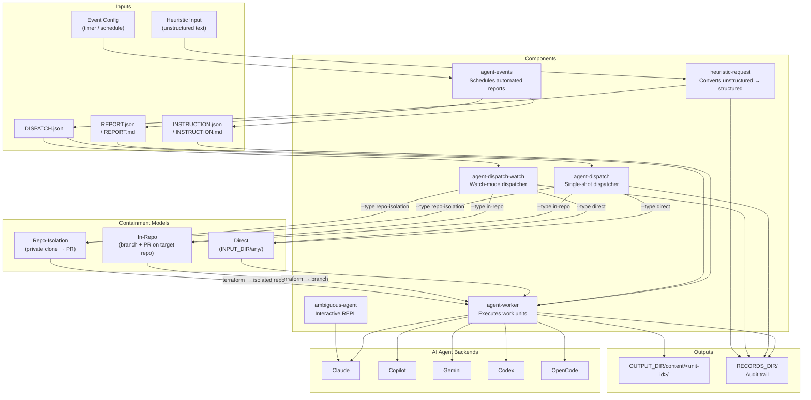
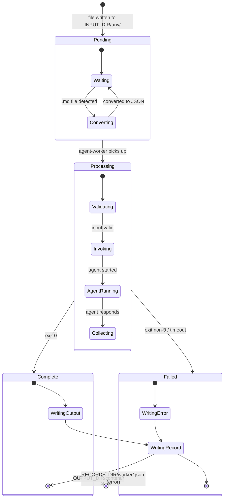
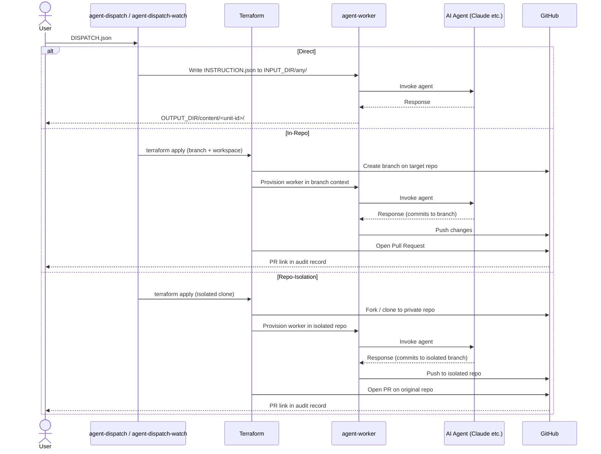

# Architecture Diagram

## System Overview

```mermaid
flowchart TD
    subgraph Inputs["Inputs"]
        HI["Heuristic Input\n(unstructured text)"]
        INSTR["INSTRUCTION.json\n/ INSTRUCTION.md"]
        RPT["REPORT.json\n/ REPORT.md"]
        DISP["DISPATCH.json"]
        EVT["Event Config\n(timer / schedule)"]
    end

    subgraph Components["Components"]
        HR["heuristic-request\nConverts unstructured → structured"]
        AW["agent-worker\nExecutes work units"]
        AE["agent-events\nSchedules automated reports"]
        AA["ambiguous-agent\nInteractive REPL"]
        AD["agent-dispatch\nSingle-shot dispatcher"]
        ADW["agent-dispatch-watch\nWatch-mode dispatcher"]
    end

    subgraph Containment["Containment Models"]
        direction TB
        C1["Direct\n(INPUT_DIR/any/)"]
        C2["In-Repo\n(branch + PR on target repo)"]
        C3["Repo-Isolation\n(private clone → PR)"]
    end

    subgraph Agents["AI Agent Backends"]
        CL["Claude"]
        CP["Copilot"]
        GM["Gemini"]
        CD["Codex"]
        OC["OpenCode"]
    end

    subgraph Outputs["Outputs"]
        OUT["OUTPUT_DIR/content/&lt;unit-id&gt;/"]
        REC["RECORDS_DIR/\nAudit trail"]
    end

    HI --> HR
    HR --> DISP
    EVT --> AE
    AE --> INSTR
    AE --> RPT

    INSTR --> AW
    RPT  --> AW
    DISP --> AD
    DISP --> ADW

    AD  -->|"--type direct"| C1
    ADW -->|"--type direct"| C1
    AD  -->|"--type in-repo"| C2
    ADW -->|"--type in-repo"| C2
    AD  -->|"--type repo-isolation"| C3
    ADW -->|"--type repo-isolation"| C3

    C1 --> AW
    C2 -->|"terraform → branch"| AW
    C3 -->|"terraform → isolated repo"| AW

    AW --> CL & CP & GM & CD & OC
    AA --> CL

    AW --> OUT
    AW --> REC
    AD --> REC
    ADW --> REC
    HR --> REC
```

## Work Unit Lifecycle

```mermaid
stateDiagram-v2
    [*] --> Pending : file written to INPUT_DIR/any/

    state Pending {
        [*] --> Waiting
        Waiting --> Converting : .md file detected
        Converting --> Waiting : converted to JSON
    }

    Pending --> Processing : agent-worker picks up

    state Processing {
        [*] --> Validating
        Validating --> Invoking : input valid
        Invoking --> AgentRunning : agent started
        AgentRunning --> Collecting : agent responds
    }

    Processing --> Complete : exit 0
    Processing --> Failed : exit non-0 / timeout

    state Complete {
        [*] --> WritingOutput
        WritingOutput --> WritingRecord
        WritingRecord --> [*]
    }

    state Failed {
        [*] --> WritingError
        WritingError --> WritingRecord
        WritingRecord --> [*]
    }

    Complete --> [*] : OUTPUT_DIR/content/<unit-id>/
    Failed --> [*] : RECORDS_DIR/worker/<unit-id>.json (error)
```

## Containment Model Detail

```mermaid
sequenceDiagram
    actor User
    participant Dispatch as agent-dispatch / agent-dispatch-watch
    participant TF as Terraform
    participant Worker as agent-worker
    participant Agent as AI Agent (Claude etc.)
    participant GitHub

    User->>Dispatch: DISPATCH.json

    alt Direct
        Dispatch->>Worker: Write INSTRUCTION.json to INPUT_DIR/any/
        Worker->>Agent: Invoke agent
        Agent-->>Worker: Response
        Worker-->>User: OUTPUT_DIR/content/<unit-id>/
    else In-Repo
        Dispatch->>TF: terraform apply (branch + workspace)
        TF->>GitHub: Create branch on target repo
        TF->>Worker: Provision worker in branch context
        Worker->>Agent: Invoke agent
        Agent-->>Worker: Response (commits to branch)
        Worker->>GitHub: Push changes
        TF->>GitHub: Open Pull Request
        GitHub-->>User: PR link in audit record
    else Repo-Isolation
        Dispatch->>TF: terraform apply (isolated clone)
        TF->>GitHub: Fork / clone to private repo
        TF->>Worker: Provision worker in isolated repo
        Worker->>Agent: Invoke agent
        Agent-->>Worker: Response (commits to isolated branch)
        Worker->>GitHub: Push to isolated repo
        TF->>GitHub: Open PR on original repo
        GitHub-->>User: PR link in audit record
    end
```
