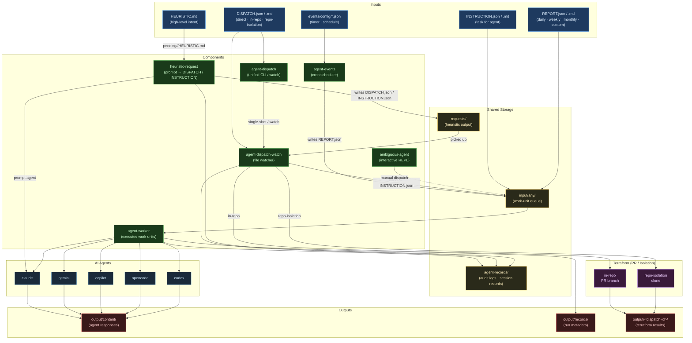
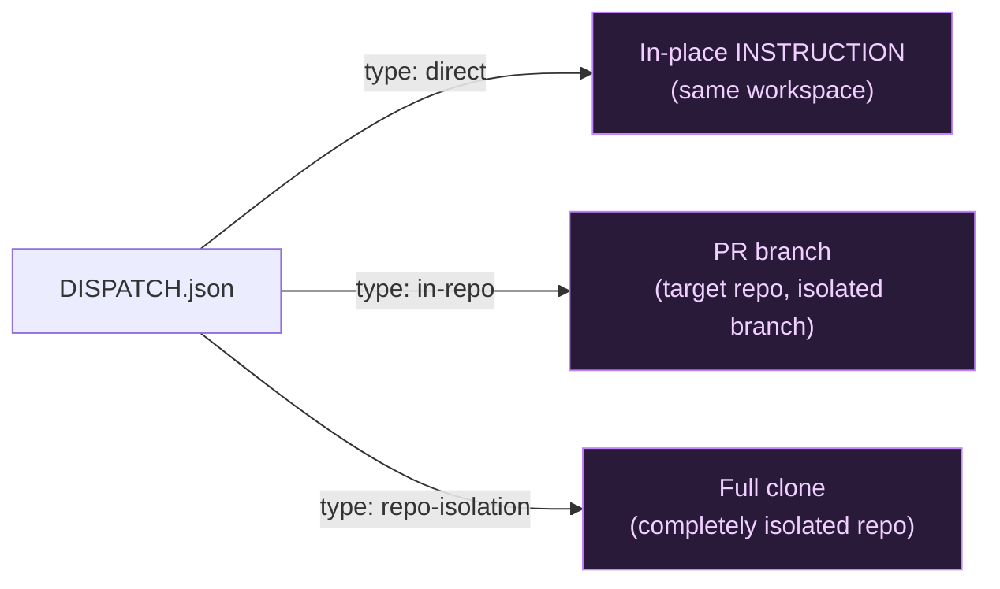

# containment-dispatcher — Architecture Diagram

## Data Flow Summary

| Source | Component | Destination |
|--------|-----------|-------------|
| `HEURISTIC.md` | `heuristic-request` | `requests/*/DISPATCH.json` or `INSTRUCTION.json` |
| `events/config/*.json` | `agent-events` | `input/any/*/REPORT.json` |
| `DISPATCH.json` (direct) | `agent-dispatch-watch` | `input/any/*/INSTRUCTION.json` |
| `DISPATCH.json` (in-repo) | `agent-dispatch-watch` → Terraform | `output/<id>/` (PR branch) |
| `DISPATCH.json` (repo-isolation) | `agent-dispatch-watch` → Terraform | `output/<id>/` (isolated clone) |
| `INSTRUCTION.json` / `REPORT.json` | `agent-worker` | `output/content/` + `output/records/` |

## Containment Strategies

