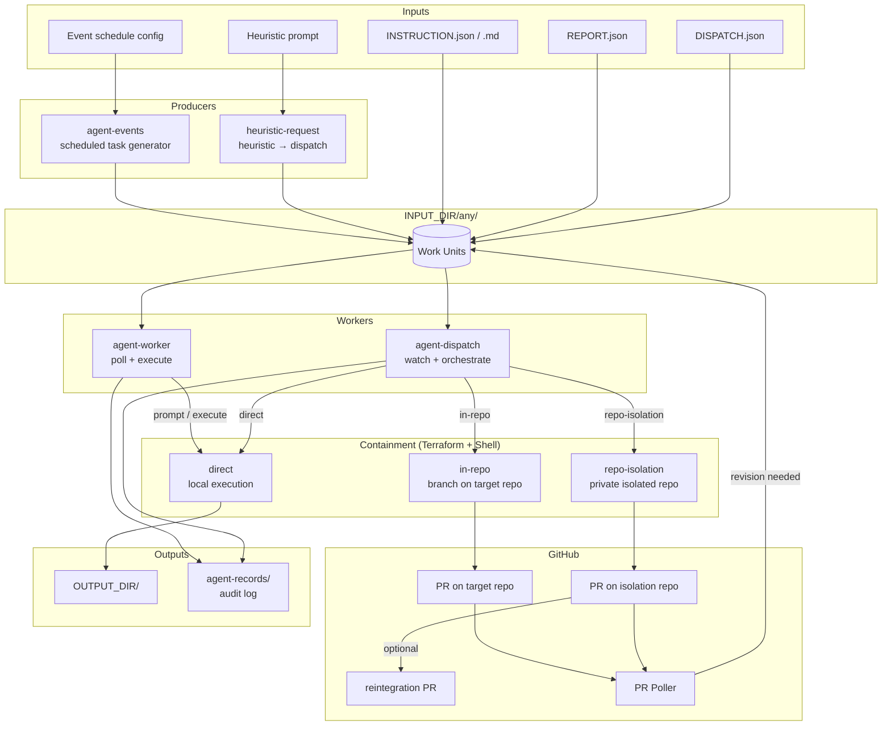

# slopspaces

An AI agent sandboxing and containment system that safely dispatches work to AI agents with configurable isolation levels, audit trails, and human oversight via pull request workflows.

## What It Does

slopspaces orchestrates AI agent execution across three containment strategies:

- **Direct** — fire-and-forget execution in the local environment
- **In-repo** — agent works on a branch inside a target GitHub repository, then opens a PR
- **Repo-isolation** — agent works in a completely separate private repository (strongest isolation), with an optional reintegration PR back to the original target

Work units (instructions, reports, dispatches) are dropped into a watched input directory. Components pick them up, route them through the appropriate containment strategy, and produce auditable outputs.

## Architecture



## Components

| Component | Language | Role |
|---|---|---|
| `agent-worker` | Go | Polls input dir, invokes agents, writes output |
| `agent-dispatch` | Go | Routes dispatch units to containment strategies via Terraform |
| `agent-events` | Go | Generates scheduled work units (daily/weekly reports, timers) |
| `heuristic-request` | Go | Transforms heuristic prompts into dispatch requests |
| `ambiguous-agent` | Go | Interactive CLI for direct agent invocation (Claude, Copilot, Gemini, OpenAI, …) |
| `agent-dispatch/prpoller` | Go | Monitors GitHub PRs for agent comments and triggers re-execution |
| `agent-dispatch/modules/containment/` | Terraform + Shell | IaC modules for each containment strategy |

## Work Unit Types

**INSTRUCTION** — a task for an agent to execute or respond to as a prompt.

**REPORT** — triggers generation of a periodic summary (daily, weekly, monthly).

**DISPATCH** — routes work to a containment strategy:
```json
{
  "type": "repo-isolation",
  "target_repo": "owner/repo",
  "instruction": "Implement feature X"
}
```

## Environment Variables

| Variable | Description |
|---|---|
| `INPUT_DIR` | Directory watched for incoming work units |
| `OUTPUT_DIR` | Directory where completed work is written |
| `RECORDS_DIR` | Audit log directory |
| `DISPATCHER_LIVE` | Terraform working directory for active dispatches |
| `GITHUB_PAT` | GitHub personal access token (for repo/PR operations) |

## License

MIT — see [LICENSE](LICENSE).
